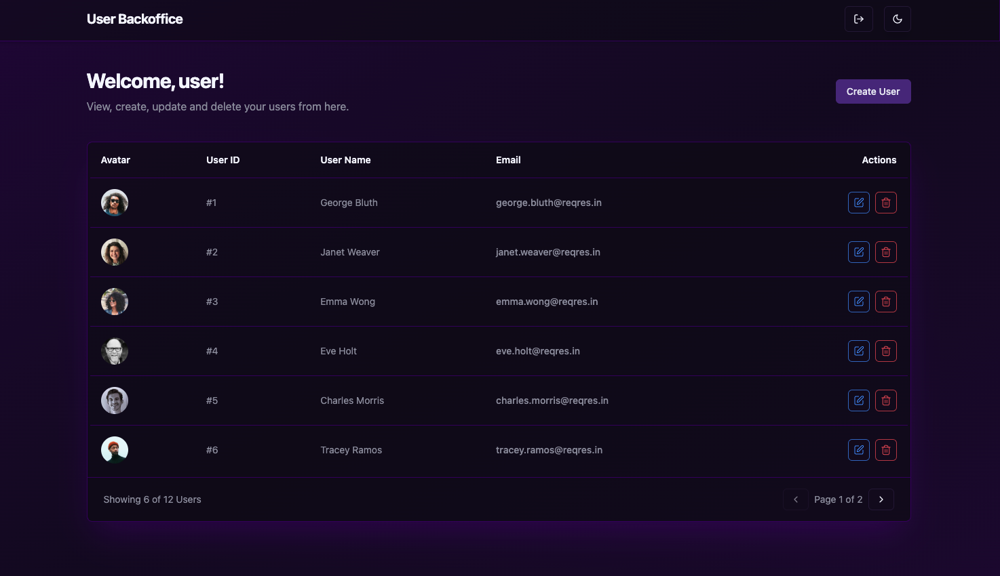
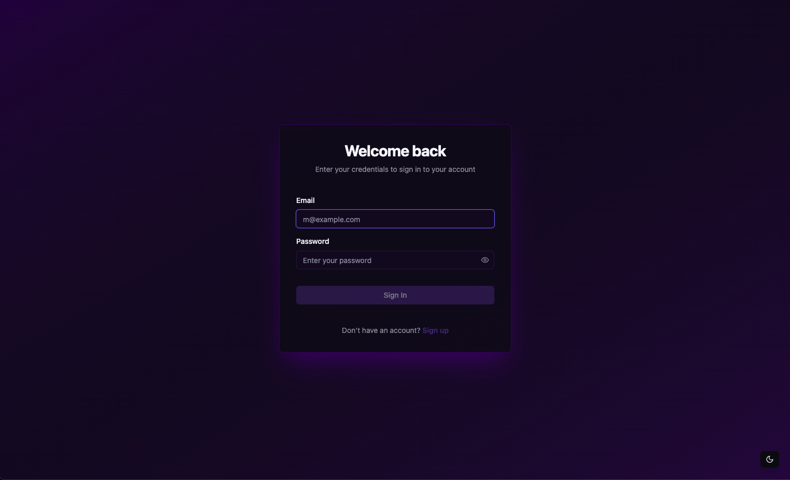
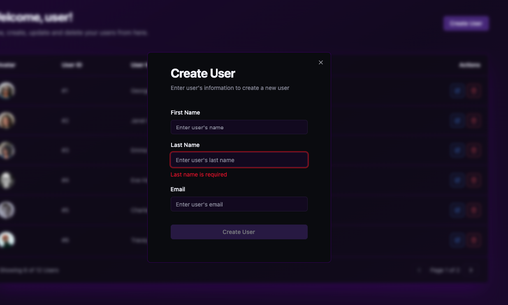
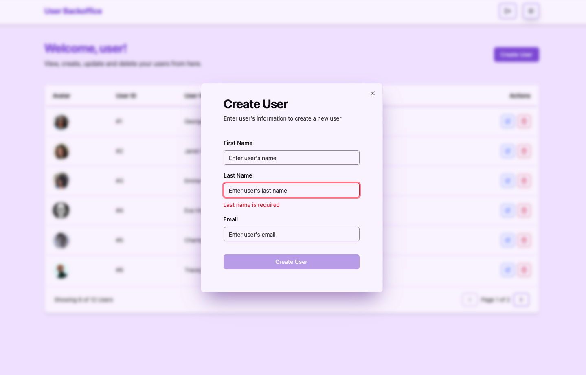

# 🚀 User Management System

[](https://reactjs.org/)
[](https://www.typescriptlang.org/)
[](https://vitejs.dev/)
[](https://jestjs.io/)
[](https://www.docker.com/)
[](LICENSE)

> A modern, full-featured user management system built with React, TypeScript, and cutting-edge web technologies. Features complete CRUD operations, authentication, responsive design, and comprehensive testing.

## ✨ Features

### 🔐 Authentication & Security
- **Complete authentication flow** with login/register
- **Protected routes** with automatic redirects
- **JWT token management** with localStorage
- **Form validation** with Zod schemas
- **Error handling** with user-friendly messages

### 👥 User Management
- **Full CRUD operations** (Create, Read, Update, Delete)
- **Responsive data table** with pagination
- **Real-time search** and filtering
- **Bulk operations** support
- **User avatar management**

### 🎨 User Experience
- **Dark/Light theme** with system preference detection
- **Responsive design** for all devices
- **Loading states** and skeleton screens
- **Toast notifications** for user feedback
- **Smooth animations** and transitions

### 🛠️ Developer Experience
- **TypeScript** with strict configuration
- **Hot module replacement** with Vite
- **ESLint + Prettier** for code quality
- **Husky hooks** for pre-commit validation
- **Comprehensive testing** (99.45% coverage)

## 📸 Screenshots

### Dashboard Overview


### Authentication Page


### User Modal


### Light Theme


## 🚀 Quick Start

### Prerequisites
- **Node.js** v20.18.1
- **pnpm** (recommended) or npm
- **Docker** (optional, for containerized development)

### Installation

```bash
# Clone the repository
git clone <repository-url>
cd users-management

# Install dependencies
pnpm install

# Set up environment variables
cp .env.example .env.development
# Edit .env.development with your API credentials

# Start development server
pnpm dev
```

The application will be available at `http://localhost:5173`

## 🐳 Docker Setup

### Quick Start with Docker

```bash
# Using Makefile (recommended)
make dev

# Or using Docker Compose directly
docker-compose up app-dev
```

### Available Docker Commands

```bash
# Development
make dev              # Start development environment
make dev-build        # Build and start development
make dev-detached     # Start in background

# Production
make prod             # Start production environment
make prod-build       # Build and start production

# Utilities
make build            # Build all images
make clean            # Clean up containers
make logs             # View logs
make shell            # Access container shell
```

## 🧪 Testing

### Unit Tests
```bash
# Run all tests
pnpm test

# Run with coverage
pnpm test:coverage

# Run in watch mode
pnpm test:watch
```

**Current Coverage: 99.45%** 🎯

### E2E Tests
```bash
# Start dev server first
pnpm dev

# Run E2E tests
pnpm test:e2e

# Open Cypress Test Runner
pnpm test:e2e:open
```

## 📁 Project Structure

```
src/
├── components/          # Reusable UI components
│   ├── ui/             # ShadCN UI components
│   ├── forms/          # Form components
│   ├── layout/         # Layout components
│   └── navigation/     # Navigation components
├── pages/              # Page components
│   ├── auth/           # Authentication pages
│   └── dashboard/      # Dashboard pages
├── hooks/              # Custom React hooks
├── services/           # API services
├── stores/             # Zustand state management
├── schemas/            # Zod validation schemas
├── utils/              # Utility functions
└── constants/          # Application constants

cypress/
├── e2e/                # E2E test files
├── support/            # Test support files
└── fixtures/           # Test data

docs/                   # Project documentation
```

## 🔧 Configuration

### Environment Variables

Create `.env.development` and `.env.production` files:

```env
# API Configuration
VITE_API_URL=https://reqres.in/api
VITE_API_KEY=your-api-key-here

# Application
VITE_APP_NAME=User Management System
VITE_APP_VERSION=1.0.0

# Features
VITE_ENABLE_DEBUG=true
VITE_ENABLE_ANALYTICS=false
```

### Available Scripts

```bash
# Development
pnpm dev              # Start development server
pnpm build            # Build for production
pnpm preview          # Preview production build

# Testing
pnpm test             # Run unit tests
pnpm test:coverage    # Run tests with coverage
pnpm test:e2e         # Run E2E tests

# Code Quality
pnpm lint             # Run ESLint
pnpm format           # Format code with Prettier

# Docker
pnpm dev:docker       # Start with Docker
```

## 🏗️ Architecture

### Tech Stack

- **Frontend Framework:** React 19 with TypeScript
- **Build Tool:** Vite for fast development and optimized builds
- **Styling:** TailwindCSS with ShadCN UI components
- **State Management:** Zustand for global state, TanStack Query for server state
- **Forms:** React Hook Form with Zod validation
- **Routing:** React Router v6 with lazy loading
- **Testing:** Jest + React Testing Library + Cypress
- **Code Quality:** ESLint + Prettier + Husky + Commitlint

### Key Design Patterns

- **Component Composition:** Reusable, composable components
- **Custom Hooks:** Logic extraction and reusability
- **Service Layer:** Centralized API communication
- **Error Boundaries:** Graceful error handling
- **Lazy Loading:** Code splitting for performance

## 🚀 Deployment

### Production Build

```bash
# Build the application
pnpm build

# The built files will be in the `dist/` directory
```

### Docker Production

```bash
# Build production image
make build-prod

# Run production container
make prod
```

### Environment Setup

```bash
# Setup environment files
make env-setup

# Edit production environment
nano .env.production
```


## 📚 Documentation

- [Architecture Guide](./docs/ARCHITECTURE.md) - Detailed technical architecture
- [API Documentation](./docs/API_DOCUMENTATION.md) - API endpoints and usage
- [Testing Strategy](./docs/TESTING_STRATEGY.md) - Testing approach and guidelines
- [Deployment Guide](./docs/DEPLOYMENT.md) - Deployment instructions
- [Performance Guide](./docs/PERFORMANCE.md) - Performance optimizations
- [Security Guide](./docs/SECURITY.md) - Security considerations


## 🙏 Acknowledgments

- [ReqRes API](https://reqres.in/) for the mock API
- [ShadCN UI](https://ui.shadcn.com/) for the beautiful components
- [TanStack](https://tanstack.com/) for excellent React libraries
- [Vite](https://vitejs.dev/) for the blazing fast build tool

---


